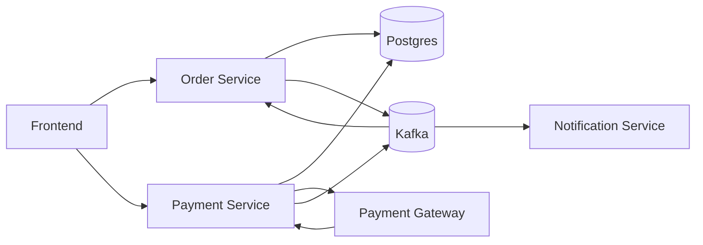

# payment system

Payment system using Go and Kafka (in progress)<br>
Database: Postgres 16



- [x]  Order Service
  - [x]  create consumer for payment events
- [x]  Payment Service
  - [x]  create gateway mock call
  - [x]  guarantee idempotency for gateway handling
- [ ]  Notification service
  - [ ]  implement email notification for payment events

### Clone the repository

```bash
  git clone https://github.com/Emanueltyc/kafka-go-payment-system
  cd kafka-go-payment-system
```

### Configure environment variables

#### Linux/Unix
```bash
  cp .env.example .env
```
#### Windows
```bash
  copy .env.example .env
```

### Run Docker

```bash
  docker compose up --build -d
```
